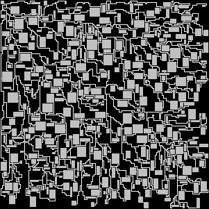

This is API-only module for generating all kinds of mazes 
(currently not all are yet correctly supported).
An exemplar maze generated by this module may, when rendered, look like this:  

This module provides access to the customizable generated maze through its 
(well defined) API, and should be easy to use  in whatever usecase. All code in
this module should be also capable of being run standalone.
